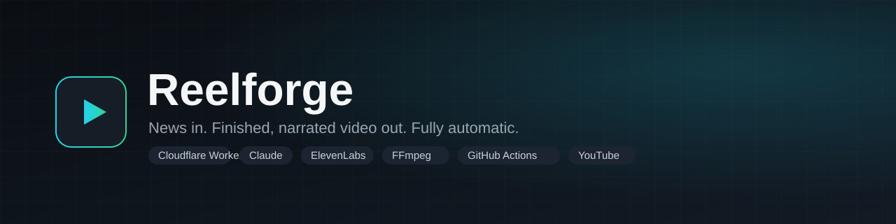

<p align="center">
  
</p>

<p align="center">
  
  
  
  
  
  
</p>

# Reelforge

Turns a news topic into a finished, faceless video and publishes it to YouTube — no manual editing, no manual upload. Built to run unattended on a daily schedule, with a human approval step before anything goes public.

## Example output

https://github.com/user-attachments/assets/ae29bd53-ba4c-42a9-94dd-29a41d8f7913

Generated end-to-end by the pipeline below, from a single RSS story to a rendered, captioned, voiced video. Currently unlisted pending review.

## Topic ideas

The topic is a config row, not code — point it at any RSS feed and it works. Ideas to get started:

- Tech or AI news
- Sports scores and recaps
- Stock market / crypto daily recap
- True crime headlines
- Local city news
- Motivational quotes or daily facts
- Product launches and reviews
- Weather and climate alerts
- History "on this day" content
- Niche industry news (real estate, health, gaming, etc.)

## How it works

Reelforge is two systems working together: a **control app** that decides what to make and when, and a **render engine** that does the actual video production.

```
Browser dashboard
      │
      ▼
Cloudflare Worker (API, cron trigger, D1 database)
      │
      ▼  triggers via GitHub REST API
GitHub Actions workflow
  1. Claude    → writes the script, splits it into segments with image keywords
  2. ElevenLabs → generates voice audio with word-level timestamps
  3. Pexels    → fetches a matching image per segment
  4. FFmpeg    → composites images + captions + audio into an MP4
  5. YouTube Data API → uploads the video as unlisted
      │
      ▼ webhook callback
Cloudflare Worker marks the run "pending approval"
      │
      ▼ human clicks Approve
YouTube Data API flips the video to public
```

The topic (subject, RSS source, voice, aspect ratio) is stored as a database row, not hardcoded — adding a new content topic requires no new code, only a new row.

## Stack

| Layer | Technology |
|---|---|
| Control app | Cloudflare Workers, Hono, D1 |
| Scheduling | Cloudflare Cron Triggers |
| Render engine | Python, GitHub Actions (free compute, no server) |
| Script generation | Claude API |
| Voice | ElevenLabs (with word-level timestamps) |
| Stock imagery | Pexels API |
| Video assembly | FFmpeg |
| Publishing | YouTube Data API v3 |

## Repository layout

```
app/                     Cloudflare Worker — dashboard, API, cron, D1 schema
  src/index.ts           Routes, cron handler, webhook receiver
  src/pipeline.ts        Trigger + approve logic (shared by cron and manual run)
  src/clients/           GitHub and YouTube API clients
  public/index.html      Dashboard UI
  schema.sql             D1 tables: topics, runs

render/                  GitHub Actions render engine
  render.py              Script → voice → footage → FFmpeg render → YouTube upload
  requirements.txt

.github/workflows/       make-video.yml — the Actions workflow render.py runs in

PLANNING.md              Architecture decisions and design rationale
```

## Setup

**1. Cloudflare Worker secrets** (`wrangler secret put <NAME>`, run from `app/`):

| Secret | Purpose |
|---|---|
| `GITHUB_TOKEN` | Fine-grained PAT, scoped to this repo, Actions: Read and write |
| `GITHUB_OWNER` / `GITHUB_REPO` | Identifies the repo to dispatch the render workflow to |
| `YOUTUBE_CLIENT_ID` / `YOUTUBE_CLIENT_SECRET` / `YOUTUBE_REFRESH_TOKEN` | OAuth credentials for the Approve step |
| `WEBHOOK_SECRET` | Shared secret verifying the render job's callback |

**2. GitHub Actions repo secrets** (Settings → Secrets and variables → Actions):

| Secret | Purpose |
|---|---|
| `ANTHROPIC_API_KEY` | Script generation |
| `ELEVENLABS_API_KEY` | Voice synthesis |
| `PEXELS_API_KEY` | Stock imagery |
| `YOUTUBE_CLIENT_ID` / `YOUTUBE_CLIENT_SECRET` / `YOUTUBE_REFRESH_TOKEN` | Uploads the finished video |

**3. Database:**

```bash
cd app
npx wrangler d1 execute reelforge-db --remote --file=./schema.sql
```

**4. Deploy:**

```bash
cd app
npm install
npx wrangler deploy
```

**5. Add a topic** via the dashboard, or directly:

```bash
curl -X POST https://<your-worker-url>/api/topics \
  -H "Content-Type: application/json" \
  -d '{"name":"My Topic","rss_source":"<rss-url>","aspect_ratio":"9:16","voice_id":"<elevenlabs-voice-id>"}'
```

## Design decisions

See [PLANNING.md](./PLANNING.md) for the full rationale — why GitHub Actions instead of a VPS, why the render logic is original code rather than a forked tool, and the open questions resolved along the way.

## Contributors

<a href="https://github.com/Sebastians007"></a>
